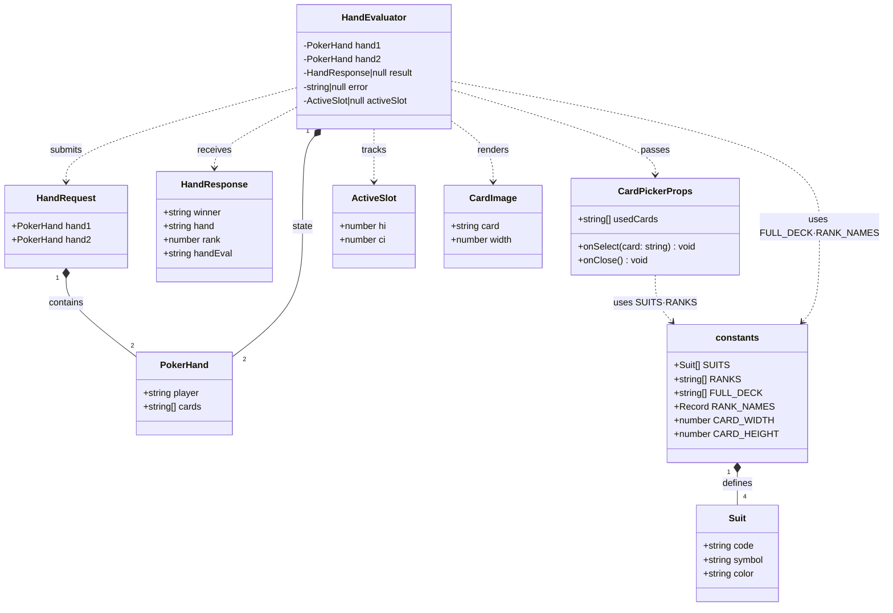
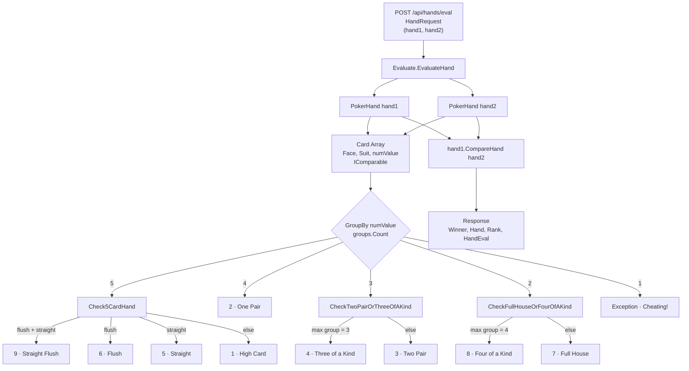
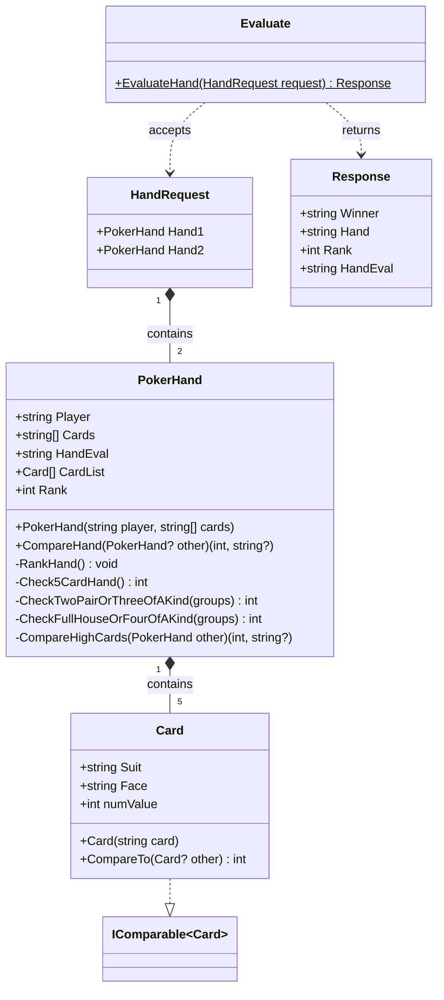

# Poker Hand Evaluator

## Design Decisions

### UI
For the user interface, I chose react, typescript, Vite as the build environment.  This is the current recommended environment, so I opted for this. 

Most of the logic for this is contained in the src/PokerHand folder. 
The images for the cards, are using a large SVG image, and parceling them up into individual card elements based on the text name: 2H - 2 of hearts, KC - King of Clubs, etc... 

The main logic is in the HandEvaluator component, separating elements of the selection and display to CardPicker and CardImage components.  

The UI works on desktop browsers, and should work on mobile devices, or using the Device toolbar on the browser tools.




### Backend
For the backend, I implemented a web api using dotnet 10 as the platform.  
In the search to keep things simple, the scaffolding is pretty much the default from the "new" template.  
Most of the source changes are in the "Deck" folder. 

The logic is predicated on card values and groupings of same cards or suits.  
The value of the card (2-10,A,K,Q,J) equate to integer values which allows some simplification of the Straight detections, as well as providing a simplistic comparison of values of the hand.  

For the service, there's just a simple mapping of the endpoint that just provides the evaluation of the hand.  This could be extended, but for the sake of this exercise it's left at comparing 2 hands. 

In the case of a tie, there's an evaluation that's run to calculate the high card, and it will append to the hand's evaluated text, which will be displayed on the "win" screen.

There are some limited tests written to help develop the hand evaluation logic, mostly used as a TDD process to bootstrap the initial algorithm development.  This is not complete, nor does it provide full coverage.


to run the tests: 
```bash
cd ./tests
dotnet test
```




## How to build and run: 
### Requirements
The base requirements for this package are as follows: 
- Dotnet - v10.x
- node > 24
- npm > v10

### Docker
For simplicity sake, and portability, I provided a docker compose file that will load both the server and the client and provides the proxy settings to make things work.  
Just a simple: 
```bash
docker compose up --build
```
Open Browser to: 
http://localhost:5050

### Script
For running in linux, I provided the shell script to load up the development servers for the server and client as well as launch a browser window. 
The script is for linux only. 

```bash
chmod +x ./buildandrun.sh
./buildandrun.sh
```

This script will trap the interrupt and wait for the processes to die before ending. 

### Manual
If you really want to do things manually, you will need to run the server and the client.  
Server: 
```bash
cd ./api
dotnet run
```

Client: 
```bash
cd ./client
npm install
npm run dev
```

Browser: 
Open http://localhost:5173